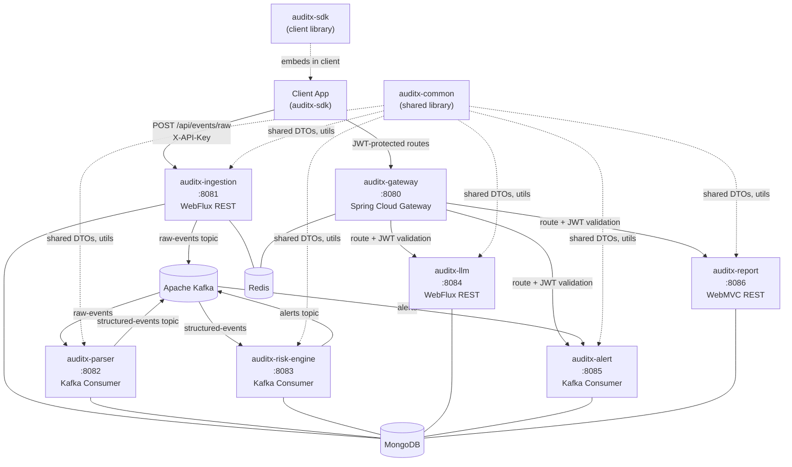

# AUDITX Platform — Technical Design Document

## Overview

AUDITX is a production-grade multi-tenant Identity Observability and Compliance Platform. It ingests raw and structured audit logs from client applications, parses and enriches them, applies rule-based risk scoring, dispatches alerts, and generates PDF compliance reports. The platform is built on Java 17, Spring Boot 3, Spring WebFlux (reactive), MongoDB, Redis, Apache Kafka, and Docker.

The system is composed of nine Maven modules: seven backend services, one shared library (`auditx-common`), and one embeddable SDK (`auditx-sdk`). All data is strictly tenant-scoped. The architecture is event-driven and loosely coupled via Kafka topics. Both cloud-managed and on-premises infrastructure are supported via Spring deployment profiles. Relational database storage (MySQL, PostgreSQL, Oracle) is supported alongside MongoDB via RDBMS Spring profiles. All REST APIs are documented via Swagger/OpenAPI 3.0.

### Design Goals

- Multi-tenancy with strict data isolation at every layer
- High-throughput, idempotent event ingestion via Kafka
- Extensible parsing and risk-scoring via strategy and rule patterns
- Correlated structured logging across all services via MDC propagation
- Pluggable storage backends (MongoDB default, JPA for RDBMS)
- Single-command local development via Docker Compose
- Interactive API documentation via SpringDoc/OpenAPI 3.0


---

## Architecture

### System Component Diagram



### Kafka Topic Flow

```
raw-events  ──► Parser_Service ──► structured-events ──► Risk_Engine ──► alerts ──► Alert_Service
```

### Request Flow (Ingestion)

```
Client ──► POST /api/events/raw (X-API-Key) ──► Ingestion_Service
           ├── validate API key (SHA-256 vs MongoDB tenants)
           ├── check idempotency key (Redis)
           ├── check rate limit (Redis sliding window)
           ├── publish to raw-events (Kafka, with MDC headers)
           └── return HTTP 202 {eventId}
```

### Request Flow (Dashboard / LLM / Report)

```
Client ──► JWT ──► API_Gateway ──► validate JWT (JWKS)
                                  ├── extract tenantId, userId, roles
                                  ├── add X-Tenant-Id, X-User-Id headers
                                  ├── enforce rate limit (Redis)
                                  └── proxy to downstream service
```


---

## Components and Interfaces

### Maven Multi-Module Structure

```
auditx/
├── pom.xml                          (root BOM, Java 17, Spring Boot 3.x)
├── auditx-common/                   (shared library — no Spring Boot main)
├── auditx-gateway/                  (Spring Cloud Gateway, WebFlux)
├── auditx-ingestion/                (WebFlux REST + Kafka producer)
├── auditx-parser/                   (Kafka consumer, MongoDB writer)
├── auditx-risk-engine/              (Kafka consumer, MongoDB updater)
├── auditx-llm/                      (WebFlux REST, LLM provider client)
├── auditx-alert/                    (Kafka consumer, webhook/email dispatcher)
├── auditx-report/                   (WebMVC REST, PDF generator)
├── auditx-sdk/                      (Spring Boot auto-configuration library)
├── docker-compose.yml
├── DEPLOYMENT.md
└── .env
```

Root `pom.xml` declares `<modules>` for all nine artifacts, sets `java.version=17`, and manages Spring Boot BOM via `spring-boot-starter-parent`.

### Dependency Graph

```
auditx-common  ◄── auditx-gateway
auditx-common  ◄── auditx-ingestion
auditx-common  ◄── auditx-parser
auditx-common  ◄── auditx-risk-engine
auditx-common  ◄── auditx-llm
auditx-common  ◄── auditx-alert
auditx-common  ◄── auditx-report
auditx-common  ◄── auditx-sdk
```

No service module depends on another service module. All cross-cutting concerns flow through `auditx-common`.

### Package Structure (per service module)

```
com.auditx.<service>/
├── config/          (Spring @Configuration, security, Kafka, Redis beans)
├── controller/      (REST controllers with OpenAPI annotations)
├── service/         (business logic, @Service)
├── repository/      (Spring Data interfaces + implementations)
├── model/           (domain objects, MongoDB @Document classes)
├── dto/             (request/response DTOs, shared with auditx-common)
├── filter/          (MdcWebFilter, MdcServletFilter, rate limit filters)
├── kafka/           (producers, consumers, interceptors)
└── exception/       (custom exceptions, @ControllerAdvice handlers)
```

`auditx-common` package: `com.auditx.common/`
```
├── dto/             (AuditEventDto, RawEventRequest, AlertDto, etc.)
├── constants/       (KafkaTopics, MdcKeys)
├── util/            (MdcUtil, IdempotencyKeyGenerator)
├── exception/       (AuditxException, TenantNotFoundException, etc.)
└── mdc/             (MdcWebFilter, MdcServletFilter, MdcKafkaConsumerInterceptor)
```

### auditx-common: MdcUtil

```java
// com.auditx.common.util.MdcUtil
public final class MdcUtil {
    public static final String TRACE_ID  = "traceId";
    public static final String TENANT_ID = "tenantId";
    public static final String USER_ID   = "userId";
    public static final String EVENT_ID  = "eventId";
    public static final String SERVICE   = "service";

    public static void setRequestContext(String traceId, String tenantId, String userId) {
        MDC.put(TRACE_ID,  traceId  != null ? traceId  : "unknown");
        MDC.put(TENANT_ID, tenantId != null ? tenantId : "unknown");
        MDC.put(USER_ID,   userId   != null ? userId   : "unknown");
    }

    public static void setEventContext(String traceId, String tenantId, String eventId) {
        MDC.put(TRACE_ID,  traceId  != null ? traceId  : "unknown");
        MDC.put(TENANT_ID, tenantId != null ? tenantId : "unknown");
        MDC.put(EVENT_ID,  eventId  != null ? eventId  : "unknown");
    }

    public static void clear() {
        MDC.remove(TRACE_ID);
        MDC.remove(TENANT_ID);
        MDC.remove(USER_ID);
        MDC.remove(EVENT_ID);
    }
}
```

### auditx-common: MdcWebFilter (WebFlux)

```java
// com.auditx.common.mdc.MdcWebFilter
@Component
public class MdcWebFilter implements WebFilter {
    @Override
    public Mono<Void> filter(ServerWebExchange exchange, WebFilterChain chain) {
        String traceId   = Optional.ofNullable(exchange.getRequest().getHeaders()
                               .getFirst("X-Trace-Id")).orElse(UUID.randomUUID().toString());
        String tenantId  = exchange.getRequest().getHeaders().getFirst("X-Tenant-Id");
        String userId    = exchange.getRequest().getHeaders().getFirst("X-User-Id");

        MdcUtil.setRequestContext(traceId, tenantId, userId);
        exchange.getResponse().getHeaders().set("X-Trace-Id", traceId);

        return chain.filter(exchange)
            .doFinally(signal -> MdcUtil.clear());
    }
}
```

### auditx-common: MdcServletFilter (Servlet / WebMVC)

```java
// com.auditx.common.mdc.MdcServletFilter
public class MdcServletFilter extends OncePerRequestFilter {
    @Override
    protected void doFilterInternal(HttpServletRequest req, HttpServletResponse res,
                                    FilterChain chain) throws ServletException, IOException {
        String traceId  = Optional.ofNullable(req.getHeader("X-Trace-Id"))
                              .orElse(UUID.randomUUID().toString());
        String tenantId = req.getHeader("X-Tenant-Id");
        String userId   = req.getHeader("X-User-Id");
        try {
            MdcUtil.setRequestContext(traceId, tenantId, userId);
            res.setHeader("X-Trace-Id", traceId);
            chain.doFilter(req, res);
        } finally {
            MdcUtil.clear();
        }
    }
}
```

### auditx-common: MdcKafkaConsumerInterceptor

```java
// com.auditx.common.mdc.MdcKafkaConsumerInterceptor
public class MdcKafkaConsumerInterceptor implements ConsumerInterceptor<String, String> {
    @Override
    public ConsumerRecords<String, String> onConsume(ConsumerRecords<String, String> records) {
        // MDC is set per-record in the listener; interceptor extracts headers
        // and stores them in a thread-local for the listener to pick up.
        // Actual MDC population happens in a shared @KafkaListener wrapper.
        return records;
    }
    @Override public void onCommit(Map<TopicPartition, OffsetAndMetadata> offsets) {}
    @Override public void close() {}
    @Override public void configure(Map<String, ?> configs) {}
}
```

Each `@KafkaListener` method wraps its body:
```java
String traceId  = new String(record.headers().lastHeader("traceId").value());
String tenantId = new String(record.headers().lastHeader("tenantId").value());
MdcUtil.setEventContext(traceId, tenantId, record.key());
try {
    // business logic
} finally {
    MdcUtil.clear();
}
```

### Kafka MDC Header Propagation (Producer Side)

Before publishing any `ProducerRecord`, the Kafka producer helper reads MDC and writes headers:

```java
record.headers()
    .add("traceId",  MDC.get(MdcUtil.TRACE_ID).getBytes(StandardCharsets.UTF_8))
    .add("tenantId", MDC.get(MdcUtil.TENANT_ID).getBytes(StandardCharsets.UTF_8));
```

### WebClient MDC Propagation

```java
// ExchangeFilterFunction added to every WebClient.Builder
ExchangeFilterFunction mdcPropagationFilter = (request, next) -> {
    String traceId = MDC.get(MdcUtil.TRACE_ID);
    ClientRequest enriched = ClientRequest.from(request)
        .header("X-Trace-Id", traceId != null ? traceId : "unknown")
        .build();
    return next.exchange(enriched);
};
```

### logback-spring.xml Template

```xml
<configuration>
  <springProperty scope="context" name="service" source="spring.application.name"/>
  <appender name="JSON" class="ch.qos.logback.core.ConsoleAppender">
    <encoder class="net.logstash.logback.encoder.LogstashEncoder">
      <customFields>{"service":"${service}"}</customFields>
      <includeMdcKeyName>traceId</includeMdcKeyName>
      <includeMdcKeyName>tenantId</includeMdcKeyName>
      <includeMdcKeyName>userId</includeMdcKeyName>
      <includeMdcKeyName>eventId</includeMdcKeyName>
    </encoder>
  </appender>
  <root level="INFO">
    <appender-ref ref="JSON"/>
  </root>
</configuration>
```


### API Gateway Service

**Module:** `auditx-gateway` | **Port:** 8080 | **Framework:** Spring Cloud Gateway (WebFlux)

Responsibilities: JWT validation, route forwarding, rate limiting, Swagger aggregation.

```java
// config/SecurityConfig.java
@Bean
SecurityWebFilterChain securityFilterChain(ServerHttpSecurity http) {
    return http
        .authorizeExchange(ex -> ex
            .pathMatchers("/actuator/health", "/v3/api-docs/**", "/swagger-ui/**").permitAll()
            .anyExchange().authenticated())
        .oauth2ResourceServer(oauth2 -> oauth2.jwt(Customizer.withDefaults()))
        .build();
}
```

JWT claims (`tenantId`, `sub`, `roles`) are extracted by a `GatewayFilter` and forwarded as `X-Tenant-Id`, `X-User-Id`, `X-Roles` headers.

Rate limiting uses `RedisRateLimiter` with `KeyResolver` based on `X-Tenant-Id`.

### Ingestion Service

**Module:** `auditx-ingestion` | **Port:** 8081 | **Framework:** Spring WebFlux

Key beans:
- `IngestionController` — `POST /api/events/raw`
- `ApiKeyAuthService` — SHA-256 hash comparison against `tenants` collection
- `IdempotencyService` — Redis `SETNX` with TTL
- `RateLimitService` — Redis sliding window (ZADD/ZCOUNT/ZREMRANGEBYSCORE)
- `KafkaEventPublisher` — writes MDC headers to `ProducerRecord`

### Parser Service

**Module:** `auditx-parser` | **Port:** 8082 | **Framework:** Spring Boot (Kafka consumer)

Key beans:
- `ParserKafkaListener` — `@KafkaListener(topics = "raw-events", groupId = "parser-group")`
- `ParsingStrategyRegistry` — holds ordered list of `ParsingStrategy` implementations
- `RegexParsingStrategy` — default strategy using configurable regex patterns
- `AuditEventRepository` — writes to `audit_events`
- `RawLogRepository` — writes to `raw_logs` on parse failure

### Risk Engine Service

**Module:** `auditx-risk-engine` | **Port:** 8083 | **Framework:** Spring Boot (Kafka consumer)

Key beans:
- `RiskEngineKafkaListener` — `@KafkaListener(topics = "structured-events", groupId = "risk-engine-group")`
- `RiskRuleLoader` — loads active rules from `risk_rules` collection per `tenantId`
- `RiskScoreCalculator` — sums weights of matching rules
- `FailedLoginRule` — sliding window counter via MongoDB aggregation
- `GeoAnomalyRule` — compares current country against recent login history
- `AlertPublisher` — publishes to `alerts` topic when score exceeds threshold

### LLM Service

**Module:** `auditx-llm` | **Port:** 8084 | **Framework:** Spring WebFlux

Key beans:
- `LlmController` — `POST /api/llm/explain`, `/query`, `/summarize`
- `LlmProviderFactory` — returns `OpenAiProvider` or `AzureOpenAiProvider` based on config
- `PromptTemplateLoader` — loads versioned templates from classpath
- `TenantScopedQueryEnforcer` — appends `tenantId` filter to all generated MongoDB queries
- `LlmRetryService` — 3 retries with exponential backoff (500ms base)

### Alert Service

**Module:** `auditx-alert` | **Port:** 8085 | **Framework:** Spring Boot (Kafka consumer)

Key beans:
- `AlertKafkaListener` — `@KafkaListener(topics = "alerts", groupId = "alert-service-group")`
- `AlertRepository` — writes to `alerts` collection
- `WebhookDispatcher` — HTTP POST with 3-retry exponential backoff via WebClient
- `MockEmailDispatcher` — logs email content as structured JSON
- `TenantNotificationConfig` — per-tenant channel enable/disable flags

### Report Service

**Module:** `auditx-report` | **Port:** 8086 | **Framework:** Spring WebMVC

Key beans:
- `ReportController` — `POST /api/reports/generate`
- `ReportDataAssembler` — queries `audit_events` and `alerts` for the date range
- `PdfRenderer` interface — `render(ReportData): byte[]`
- `HtmlPdfRenderer` — default implementation producing Puppeteer-compatible HTML → PDF
- `ReportService` — orchestrates assembly and rendering

### AUDITX SDK

**Module:** `auditx-sdk` | **Type:** Spring Boot auto-configuration library

Key beans:
- `AuditxAutoConfiguration` — conditional on `auditx.enabled=true`
- `AuditxHandlerInterceptor` — captures HTTP request metadata
- `AuditxLoginEventPublisher` — explicit login event API
- `AuditxEventSender` — async thread pool + retry with exponential backoff
- `IdempotencyKeyGenerator` — UUID per event, stored in-memory until ACK

### Parser Strategy Pattern

```java
// com.auditx.parser.strategy.ParsingStrategy
public interface ParsingStrategy {
    boolean canParse(String rawLog);
    StructuredEvent parse(String rawLog, String tenantId);
    int priority();  // lower = higher priority
}

// com.auditx.parser.strategy.ParsingStrategyRegistry
@Component
public class ParsingStrategyRegistry {
    private final List<ParsingStrategy> strategies;

    public ParsingStrategyRegistry(List<ParsingStrategy> strategies) {
        this.strategies = strategies.stream()
            .sorted(Comparator.comparingInt(ParsingStrategy::priority))
            .toList();
    }

    public Optional<StructuredEvent> parse(String rawLog, String tenantId) {
        return strategies.stream()
            .filter(s -> s.canParse(rawLog))
            .findFirst()
            .map(s -> s.parse(rawLog, tenantId));
    }
}
```

### Risk Scoring Algorithm

```
score = 0
for each rule in tenant.activeRules:
    if rule.matches(event):
        score += rule.weight
score = min(score, 100)

FailedLoginRule:
    count = countFailedLogins(userId, now - window)
    if count > threshold: score += rule.weight

GeoAnomalyRule:
    recentCountries = getRecentLoginCountries(userId, lookbackPeriod)
    if event.country not in recentCountries: score += rule.weight
```

### LLM Provider Abstraction

```java
public interface LlmProvider {
    Mono<String> complete(String prompt);
}

@ConditionalOnProperty(name = "auditx.llm.provider", havingValue = "openai")
@Service
public class OpenAiProvider implements LlmProvider { ... }

@ConditionalOnProperty(name = "auditx.llm.provider", havingValue = "azure-openai")
@Service
public class AzureOpenAiProvider implements LlmProvider { ... }
```

Prompt templates stored at `classpath:prompts/explain-v1.txt`, `query-v1.txt`, `summarize-v1.txt`.

### Alert Dispatch Flow

```
AlertKafkaListener.onMessage(alertDto)
  ├── idempotency check (alertId in MongoDB)
  ├── alertRepository.save(alert)
  ├── if tenant.webhookEnabled: webhookDispatcher.dispatch(alert)
  │     └── retry 3x with 500ms/1s/2s backoff
  │         └── on failure: alert.status = WEBHOOK_FAILED
  └── if tenant.emailEnabled: mockEmailDispatcher.log(alert)
```

### PDF Report Design

```java
public interface PdfRenderer {
    byte[] render(ReportData data);
}

public class ReportData {
    String tenantId;
    LocalDate startDate, endDate;
    long totalEvents;
    Map<String, Long> eventsByAction;
    List<AuditEventDto> highRiskEvents;   // riskScore >= 70
    List<AlertDto> alerts;
}
```

`HtmlPdfRenderer` generates an HTML string from a Thymeleaf template and converts it to PDF using Flying Saucer (or delegates to a Puppeteer sidecar via HTTP). The interface boundary ensures the renderer is swappable.

### Swagger / OpenAPI 3.0 Design

Each service includes:
- `springdoc-openapi-starter-webflux-ui` (reactive) or `webmvc-ui` (WebMVC)
- `@OpenAPIDefinition` on the main class with `@Info` and `@Tag` declarations
- Every controller method annotated with `@Operation`, `@ApiResponse(s)`, `@Parameter`

```java
@Tag(name = "Ingestion", description = "Raw and structured event ingestion")
@RestController
public class IngestionController {

    @Operation(summary = "Ingest a raw or structured audit event")
    @ApiResponses({
        @ApiResponse(responseCode = "202", description = "Event accepted"),
        @ApiResponse(responseCode = "401", description = "Invalid API key"),
        @ApiResponse(responseCode = "429", description = "Rate limit exceeded")
    })
    @PostMapping("/api/events/raw")
    public Mono<ResponseEntity<IngestResponse>> ingest(
        @Parameter(description = "Tenant API key") @RequestHeader("X-API-Key") String apiKey,
        @RequestBody RawEventRequest request) { ... }
}
```

Gateway aggregates downstream specs via SpringDoc multi-service config:

```yaml
# application.yml (gateway)
springdoc:
  swagger-ui:
    urls:
      - name: ingestion
        url: http://auditx-ingestion:8081/v3/api-docs
      - name: llm
        url: http://auditx-llm:8084/v3/api-docs
      - name: report
        url: http://auditx-report:8086/v3/api-docs
      - name: alert
        url: http://auditx-alert:8085/v3/api-docs
```

Swagger UI is disabled in `cloud` profile:
```yaml
# application-cloud.yml
springdoc:
  swagger-ui:
    enabled: false
  api-docs:
    enabled: false
```


### Full REST API Contracts

#### API Gateway — `auditx-gateway` (:8080)

| Method | Path | Auth | Description |
|--------|------|------|-------------|
| GET | `/actuator/health` | None | Gateway health |
| GET | `/swagger-ui.html` | None (local/onprem) | Aggregated Swagger UI |
| GET | `/v3/api-docs` | None (local/onprem) | Aggregated OpenAPI spec |
| * | `/api/llm/**` | JWT | Proxy to LLM service |
| * | `/api/reports/**` | JWT | Proxy to Report service |
| * | `/api/alerts/**` | JWT | Proxy to Alert service |

#### Ingestion Service — `auditx-ingestion` (:8081)

| Method | Path | Auth | Request Body | Response |
|--------|------|------|-------------|----------|
| POST | `/api/events/raw` | X-API-Key | `RawEventRequest` | 202 `{eventId}` / 401 / 429 / 503 |
| GET | `/actuator/health` | None | — | 200 |
| GET | `/swagger-ui.html` | None (local) | — | HTML |
| GET | `/v3/api-docs` | None | — | JSON |

`RawEventRequest`:
```json
{
  "tenantId": "string",
  "payloadType": "RAW | STRUCTURED",
  "payload": "string | object",
  "idempotencyKey": "string (optional)",
  "timestamp": "ISO-8601"
}
```

`IngestResponse`:
```json
{ "eventId": "uuid", "status": "ACCEPTED" }
```

#### LLM Service — `auditx-llm` (:8084)

| Method | Path | Auth | Request Body | Response |
|--------|------|------|-------------|----------|
| POST | `/api/llm/explain` | JWT (via GW) | `{eventId, tenantId}` | 200 `{explanation}` |
| POST | `/api/llm/query` | JWT (via GW) | `{question, tenantId}` | 200 `{results: [...]}` |
| POST | `/api/llm/summarize` | JWT (via GW) | `{alertIds: [...], tenantId}` | 200 `{summary}` |
| GET | `/actuator/health` | None | — | 200 |

#### Report Service — `auditx-report` (:8086)

| Method | Path | Auth | Request Body | Response |
|--------|------|------|-------------|----------|
| POST | `/api/reports/generate` | JWT (via GW) | `{tenantId, startDate, endDate, reportType}` | 200 PDF binary |
| GET | `/actuator/health` | None | — | 200 |

#### Alert Service — `auditx-alert` (:8085)

| Method | Path | Auth | Description |
|--------|------|------|-------------|
| GET | `/api/alerts` | JWT (via GW) | List alerts for tenant |
| GET | `/actuator/health` | None | Health check |


---

## Data Models

### MongoDB Collection Schemas

#### `audit_events`

```json
{
  "_id": "ObjectId",
  "eventId": "uuid (unique index)",
  "tenantId": "string (index)",
  "userId": "string",
  "action": "string",
  "sourceIp": "string",
  "outcome": "SUCCESS | FAILURE",
  "timestamp": "ISODate",
  "rawPayload": "string (optional)",
  "parseStatus": "PARSED | FAILED",
  "parseStrategy": "string",
  "riskScore": "int (0-100, set by Risk Engine)",
  "ruleMatches": ["string"],
  "alertPublished": "boolean",
  "computedAt": "ISODate",
  "createdAt": "ISODate"
}
```

Indexes: `tenantId`, `(tenantId, userId)`, `(tenantId, timestamp)`, 